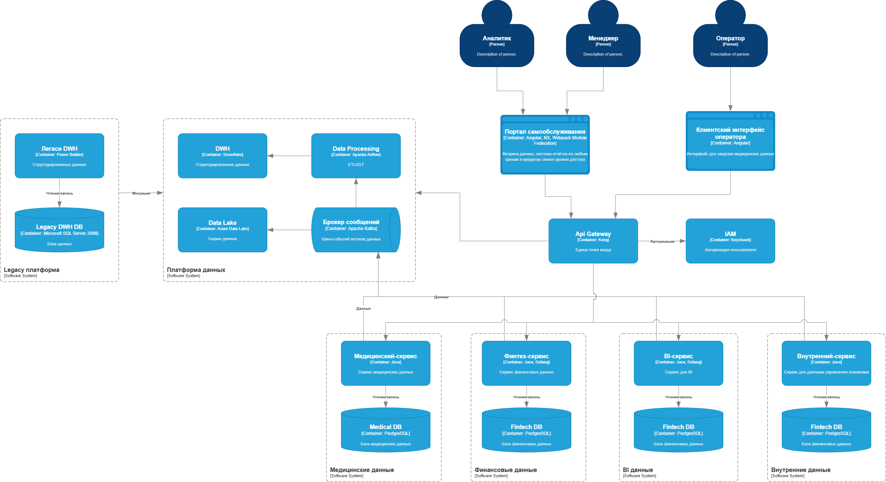

# Анализ текущих проблем

## Критически важные проблемы:

1. Устаревшая платформа хранения данных (DWH): Используется неподдерживаемая версия, что влечет за собой риски безопасности, низкую производительность и неспособность использовать современные технологии.
2. Неэффективная система безопасности: Децентрализованное управление доступом и отсутствие единых политик создают угрозы для конфиденциальной информации.
3. Высокие затраты на интеграцию: Сложная архитектура и отсутствие стандартизированных процессов значительно замедляют подключение новых источников данных.

## Значительные ограничения:

Низкая масштабируемость: Существующая инфраструктура не позволяет гибко наращивать вычислительные мощности и объемы хранения в соответствии с растущими потребностями.

##  Дополнительные возможности для улучшения:

Ограниченная функциональность BI-инструментов: Текущие системы не обеспечивают необходимый уровень самостоятельной аналитики и гибкости при построении сложных отчетов.

