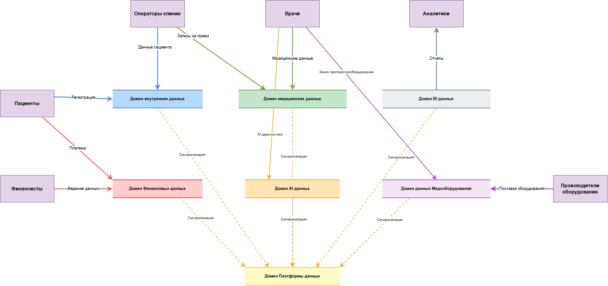

# Домены

## 1. Внутренние данные
- Управление профилями клиентов
- Персональные данные
- Внутренние данные отделений медицинских учреждений

**Обоснование:**
- **Кросс-функциональное использование**: Данные клиентов являются критически важным активом, который используется различными бизнес-направлениями (медицина, финансы, AI).
- **Специфические требования**: Данные имеют уникальный жизненный цикл и подлежат строгому регулированию в области защиты персональной информации.
- **Централизация управления**: Создание отдельного домена позволяет централизованно управлять согласиями клиентов и гарантировать соответствие законодательным нормам.

## 2. Медицинские данные
- Медицинские карты
- Записью на прием
- История болезни
- Результаты медицинских исследований

**Обоснование:**
- **Особый статус медицинских данных**: Медицинские данные относятся к информации особой категории, что обусловлено строгими требованиями к их конфиденциальности и нормативному регулированию. Соответствующий домен должен обеспечивать соблюдение медицинских стандартов, обладает уникальной бизнес-логикой и архитектурой, допускающей независимое развитие.
- **Принцип обработки данных для аналитики**: В целях обеспечения максимальной конфиденциальности персональные медицинские данные (истории болезней, медицинские карты) не передаются в аналитический домен. Для проведения анализа используются исключительно обезличенные и агрегированные данные.

## 3. BI данные
- Аналитические данных из всех доменов
- Data Lake (озеро данных)
- Data Warehouse (хранилище данных)
- OLAP-кубы
- Метрики

**Обоснование:**
- **Аналитическая нагрузка**: Поскольку аналитика потребляет данные из всех доменов, но не оказывает влияния на операционные процессы, её выделение позволяет независимо масштабировать аналитическую платформу, исключив нагрузку на операционные базы данных.
- **Ограничение доступа к конфиденциальным данным**: Аналитический домен не имеет доступа к персональным медицинским данным (историям болезней, медицинским картам). Для анализа передаются исключительно обезличенные и агрегированные данные, что обеспечивает соблюдение норм конфиденциальности.

## 4. Финансовые данные
- Данные платежей
- Кредитование
- Страхование
- Финансовый учет
- Интеграция с банками
  
**Обоснование:**
- **Организационное**: Финтех-направление выделено в отдельную компанию, обладающую банковской лицензией, что обусловлено требованиями регулятора. Домен характеризуется независимой командой разработки (Golang/Java), автономной архитектурой, обеспечивающей независимое масштабирование, и возможностью предоставления сервисов внешним клиентам, выходящим за рамки медицинского бизнеса.
- **Отказоустойчивость**: Финансовый домен функционировал абсолютно независимо от медицинской системы. Обработка платежей должна гарантированно осуществляться даже в случае полной недоступности медицинских сервисов.

## 5. AI данные
- Обучение и управление ML-моделями
- AI-диагностика заболеваний
- Персонализированные рекомендации

**Обоснование:**
- **Обособленность**: Сервисы искусственного интеллекта представляют собой самостоятельное бизнес-направление. Это обусловлено уникальными технологическими требованиями, включающими специализированный стек (Python, ML-фреймворки) и инфраструктуру (GPU-кластеры). Данная изоляция позволяет развивать и предлагать AI-решения в качестве самостоятельного продукта для сторонних медицинских учреждений.
- **Механизм интеграции**: Домен AI функционирует по модели подписки на события, генерируемые медицинскими системами, что обеспечивает постоянное обучение и актуализацию моделей. Взаимодействие с другими системами осуществляется через API, которое предоставляет сервисы прогнозирования и аналитических рекомендаций.

### 5. Данные медооборудований
- Складские запасы
- Закупки у поставщиков
- Интеграция с фармацевтическими компаниями
- Управление медицинским оборудованием

**Обоснование:**
- **Внешние интеграции**: Решение задачи интеграции фармацевтических компаний и производителей медицинского оборудования. Данное архитектурное решение позволяет подключать новых участников рынка без модификации бизнес-логики медицинских и финансовых систем. Домен функционирует по собственным регламентированным процессам и обладает способностью централизованно обслуживать несколько медицинских учреждений.

# Диаграмма потоков данных
